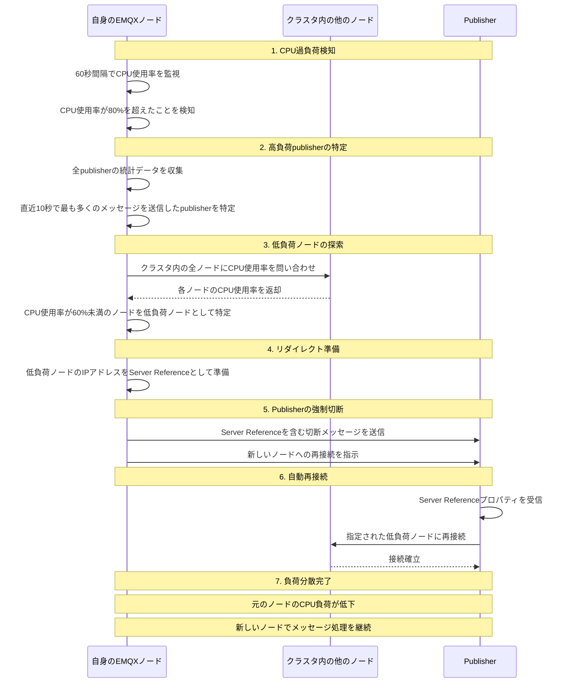

# CPU-based Publisher Redirect シーケンス図

## 概要
過負荷を検知したとき、他のノードのうちCPU使用率が低いノードをreferenceにpublisherを強制切断し再接続を促す一連のフロー

## 動作の流れ

### 1. CPU過負荷検知
- 60秒間隔でCPU使用率を監視
- CPU使用率が80%を超えた場合にリダイレクト処理を開始

### 2. 高負荷publisherの特定
- 全publisherの統計データを収集
- 直近10秒で最も多くのメッセージを送信したpublisherを特定

### 3. 低負荷ノードの探索
- クラスタ内の全ノードにCPU使用率を問い合わせ
- CPU使用率が60%未満のノードを低負荷ノードとして特定

### 4. リダイレクト準備
- 低負荷ノードのIPアドレスをServer Referenceとして準備

### 5. Publisherの強制切断
- Server Referenceを含む切断メッセージを送信
- 新しいノードへの再接続を指示

### 6. 自動再接続
- PublisherがServer Referenceプロパティを受信
- 指定された低負荷ノードに自動的に再接続

### 7. 負荷分散完了
- 元のノードのCPU負荷が低下
- 新しいノードでメッセージ処理を継続

## 設定パラメータ

- **CPU監視間隔**: 60秒
- **高負荷閾値**: 80%
- **低負荷閾値**: 60%
- **統計フィルタ期間**: 直近10秒
